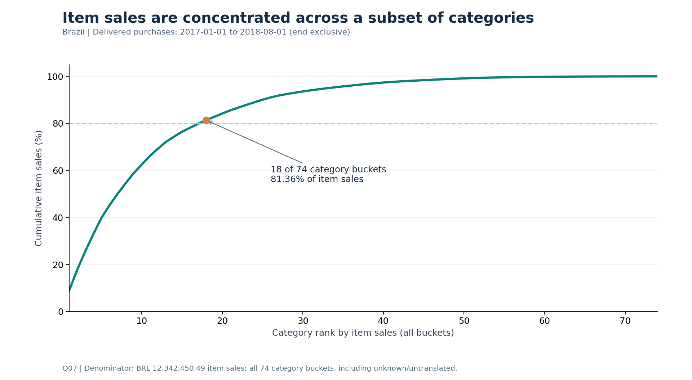
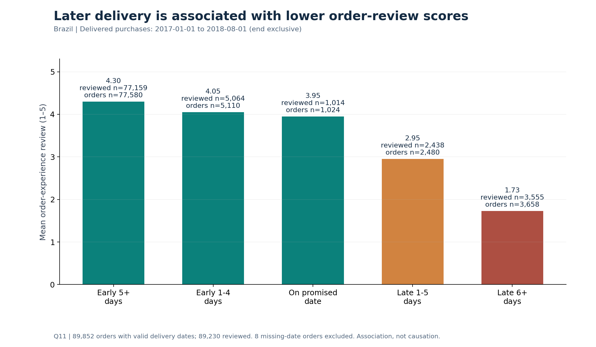

# Olist SQL: category performance and delivery experience

**Decision question:** Which categories and seller groups warrant further investigation when item sales, volume, charged freight and delivery experience are considered together?

This case study audits nine Olist CSVs from a historical Brazilian e-commerce extract spanning **2016–2018**, answers twelve business questions in SQLite, and reconciles every reported sales total before producing charts. The main analytical cohort contains delivered orders purchased in **[2017-01-01, 2018-08-01)**. Q01–Q02 examine all raw orders.

| Verified portfolio metric | Actual result |
|---|---:|
| Delivered orders | **89,860** |
| Item rows (`order_id` + `order_item_id`) | **102,738** |
| Item sales excluding freight | **BRL 12,342,450.49** |

Item sales mean `SUM(price)`. They do not measure profit, margin or platform revenue. These are actual-data results; synthetic fixtures are confined to the tests.

## Findings

- **Concentration:** 18 of 74 category buckets account for **81.3609%** of all cohort item sales. Unknown and untranslated categories stay in the denominator. [Q07](results/Q07.csv)
- **Delivery experience:** orders delivered 6+ calendar days late average **1.73/5** from **3,555 reviewed orders**; orders delivered 5+ days early average **4.30/5** from **77,159 reviewed orders**. This is an association; eight missing-date orders are excluded from delivery analysis only. [Q11](results/Q11.csv)
- **Seller exposure:** the first **503 of 2,793 sellers** cover **80.0024%** of cohort item sales. The curve uses the full seller set. Concentration alone says nothing about service quality. [Q12](results/Q12.csv)

Proposed actions are to investigate leading category roles, late delivery cases and the high-sales seller group. No intervention or achieved uplift is claimed. Read the [report](docs/REPORT.md), [executive summary](docs/EXECUTIVE_SUMMARY.md) and [claims ledger](docs/CLAIMS_LEDGER.csv) for denominators and limitations.





## SQL methods

[analysis.sql](sql/analysis.sql) retains Q01–Q12 and the original SQL unchanged: grain-aware joins, conditional aggregation, `COALESCE`/`NULLIF`, distinct order-category pairs, CTEs, `ROW_NUMBER`, cumulative window sums and a recursive month spine. Reviews are reduced to one valid selected score per order before attribution. Payments and raw reviews never multiply the item-sales fact. Same-calendar-date delivery is on the promised date. Buyers use `customer_unique_id`.

```text
sql/         Original Q01–Q12 and supplemental reconciliation SQL
src/         Audit, import, analysis, verification, charts and report CLIs
tests/       12 synthetic regression tests (no raw data required)
notebooks/   Public-safe historical executed notebook with provenance
data/        Acquisition instructions and expected input hashes
results/     Original verified aggregate snapshot and sensitivities
figures/     Six PNG charts with result-hash provenance
docs/        Report, summary, portfolio card, decisions and Thai walkthrough
evidence/   Inputs, QA, query timings, runtime and packaging verification
```

## Data and attribution

Source: **Olist, Brazilian E-Commerce Public Dataset**, [Kaggle dataset](https://www.kaggle.com/datasets/olistbr/brazilian-ecommerce). The recorded metadata labels the dataset **[CC BY-NC-SA 4.0](https://creativecommons.org/licenses/by-nc-sa/4.0/)**. It permits sharing and adaptation subject to attribution, noncommercial and share-alike conditions. See [THIRD_PARTY_DATA](THIRD_PARTY_DATA.md).

Raw CSVs, the original ZIP and the generated SQLite database are omitted to keep the package small, avoid duplicate distribution and reduce license/maintenance overhead. **This is a packaging choice, not a claim that redistribution is prohibited.** No source-code license has been selected yet. Whether a specific job-seeking portfolio use qualifies as commercial or noncommercial has not been established.

Download from the source and place the nine unedited CSVs directly in `data/raw/`, or use your own directory. The [data guide](data/README.md) lists every filename, byte size, row count and expected SHA-256; [input_manifest.json](evidence/input_manifest.json) is machine-readable. The archive SHA-256 is `967e41e04fc306fe604e2a693f488995a8b41e5047418f8a5c8e4abd6deca784`. The recorded version field is 2, updated 2021-10-01; historical numbering is ambiguous. File hashes identify the exact extract. A mismatch stops the CLI: audit the new source version before analyzing it or revising claims.

## Install and run synthetic tests

Use Python **3.12** (tested here: 3.12.14) and SQLite with window-function support. From the repository root:

```bash
python3 -m venv .venv
source .venv/bin/activate
python -m pip install -r requirements.txt
python -m unittest discover -s tests -p test_olist.py -v
```

On Windows, activate with `.venv\Scripts\Activate.ps1` in PowerShell. The synthetic suite contains **12 tests** and creates its own temporary CSVs/DBs. It needs no Olist download, network access or credentials. The analytical dependencies are pinned to the versions used for the verified snapshot.

## Reproduce actual data

With the original CSVs available, run from the repository root:

```bash
python src/run_pipeline.py --data /path/to/olist-data --out reproduced
```

Replace `/path/to/olist-data` with your directory, quoting paths that contain spaces. `reproduced/` must not already exist and is ignored by Git. The pipeline verifies input hashes, performs the pre-import audit, imports a new database, runs Q01–Q12 plus supplemental checks, requires **20 passing actual-data QA checks**, compares the aggregates with the delivered snapshot, then generates figures and a guarded Markdown report. It stops on failure. No downloader is included.

Individual stages accept explicit paths and can also run from another working directory when you provide the script's path:

```bash
python src/audit_raw.py --data /path/to/olist-data --out audit_reproduced
python src/import_olist.py --data /path/to/olist-data --db reproduced.db --start 2017-01-01 --end 2018-08-01
python src/run_analysis.py --db reproduced.db --out results_reproduced --evidence evidence_reproduced
python src/verify_results.py --results results_reproduced --evidence evidence_reproduced
python src/make_charts.py --results results_reproduced --evidence evidence_reproduced --out charts_reproduced
python src/build_report.py --results results_reproduced --evidence evidence_reproduced --figures charts_reproduced --out docs_reproduced
```

All command-line entry points expose `--help` (`provenance.py` is a shared library). Input paths are relative to your current directory unless absolute; bundled SQL/reference paths are resolved from the script location. Scripts refuse to overwrite output directories or a database. Charts verify the actual result/evidence hashes, not just a marker's existence. The report additionally checks every result against the locked snapshot and verifies that figures belong to those results.

For optional package and tamper checks (also without raw data):

```bash
python src/check_package.py
python tests/check_guards.py
```

## Check reconciliation and traceability

```bash
python src/verify_results.py --results results
python src/verify_results.py --results reproduced/results --out reproduced/comparison_review.json
```

Inspect [20 QA checks](evidence/qa_checks.csv), [integer-cent category totals](results/category_totals_cents.csv), [query SQL hashes and timings](evidence/query_execution.csv), [runtime](evidence/runtime.json) and [reproduction comparison](evidence/reproduction_comparison.json). Text, counts, ranks, integer cents and row order must match exactly; per-cell BRL differences may be at most **0.01 BRL**, and percentage/average columns at most **1e-9**. Metrics and window match exactly. This run's actual differences are recorded in the comparison file.

The delivered result CSVs retain their original bytes. The QA certificate binds them to input and SQL hashes after independent recomputation. Q03 is a top-15 display and cannot reconcile all sales; Q07 and the cents table include all 74 buckets. Q12 includes pseudonymous seller group keys needed for full aggregate equality; no raw seller details, customers, review text or transactions are included.

## Limitations and assistance

This is a historical, delivered-only Brazilian extract. The nineteen month bins are not certified complete months; boundary-window and review-policy sensitivities are included. Category reviews describe whole orders and may be attributed to multiple categories. No causal effects, costs, lifetime retention or current-market performance are established.

AI assisted code, execution, QA and documentation; unaided authorship is not implied. The [notebook](notebooks/executed_analysis.ipynb) retains seven historical code-cell outputs from Python standard-library `exec`, **not a Jupyter kernel**. Its source paths were adapted after execution, with one temporary path redacted from stdout; it is not evidence that the edited notebook was re-executed. [Transformation details](evidence/notebook_transformations.json) and a separately rerun CLI pipeline preserve that distinction. Live GitHub/Jupyter/DBeaver UI behavior remains untested.

For the dated packaging record and remaining public-release decisions, see [GITHUB_HANDOFF](GITHUB_HANDOFF.md) and [PUBLICATION_CHECKLIST](PUBLICATION_CHECKLIST.md). The intended initial GitHub destination is the private repository `olist-sql-analysis`; this package does not authorize public visibility or GitHub Pages.
