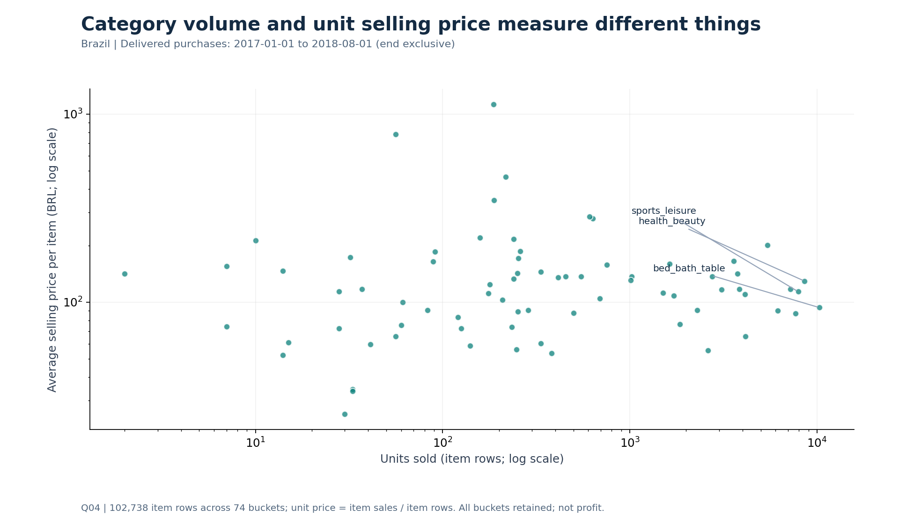
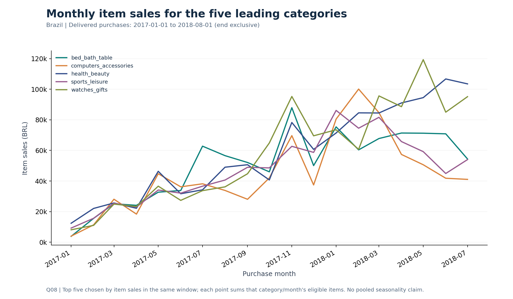
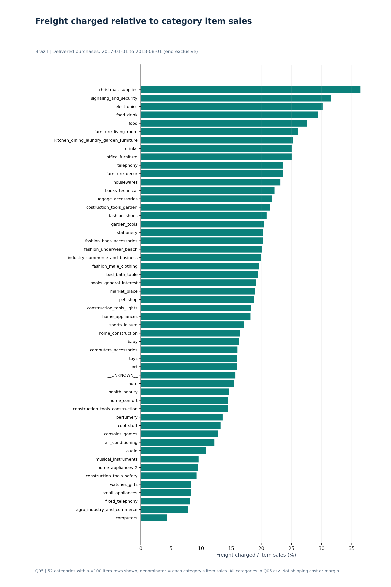
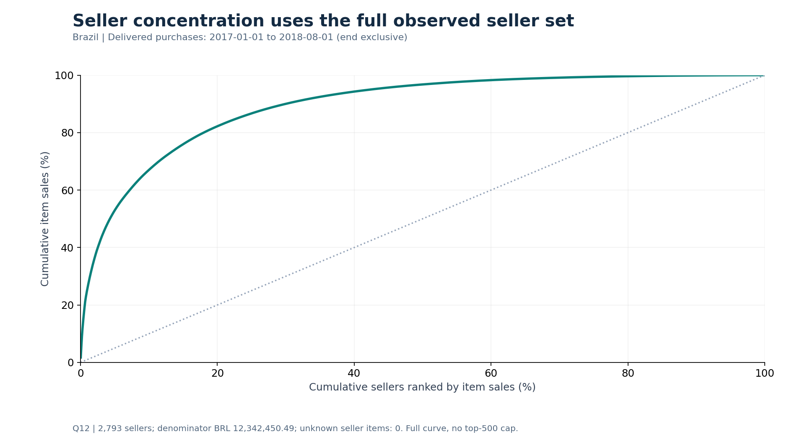

# Olist: E-commerce Category Performance
Executed SQL case study · 6 September 2026 verified snapshot

## Decision and analytical scope
Use item sales, item volume, charged freight and order experience to prioritize category and seller investigations. The analysis supports proposed investigations; it does not establish achieved business improvements.

Delivered orders purchased 1 January 2017–31 July 2018; [2017-01-01, 2018-08-01). Brazil; BRL.

**89,860 delivered orders · 102,738 item rows · BRL 12,342,450.49 item sales.** These counts come from the actual imported extract and reconcile to the complete category totals, including unknown categories. Item sales exclude freight and are neither platform revenue nor profit.

Source: [Olist's original Kaggle dataset](https://www.kaggle.com/datasets/olistbr/brazilian-ecommerce), acquired in the original 6 September 2026 execution. The recorded metadata displays CC BY-NC-SA 4.0. See [source and decisions](../docs/SOURCE_AND_DECISIONS.md) and the input hash manifest for the exact version evidence and its ambiguity.

## 1. What was analyzed, and why this window
Q01 and Q02 audit all 99,441 raw orders. Subsequent queries share one delivered-order purchase window. The 2016 records are sparse and November is absent; delivered purchases taper sharply in August 2018 and cease after August 29. September/October records contain no delivered purchases. The main analysis stops before August to reduce concerns about the end of the extract.

This creates 19 calendar-month bins, not a claim of 19 complete months. The first purchase observed in the main window is January 5, 2017. The source does not document a precise extract cutoff or prove monthly completeness. Including August and excluding January are explicit sensitivity scenarios, not replacements chosen to improve the story.

| scenario | n_orders | n_items | item_sales_brl | start_date | end_date_exclusive |
|---|---|---|---|---|---|
| main | 89860 | 102738 | 12342450.49 | 2017-01-01 | 2018-08-01 |
| include_august | 96211 | 109880 | 13181027.13 | 2017-01-01 | 2018-09-01 |
| exclude_january | 89110 | 101825 | 12230652.13 | 2017-02-01 | 2018-08-01 |

The inclusive-August scenario adds 6,351 delivered orders and BRL 838,576.64 item sales. Excluding January removes 750 orders and BRL 111,798.36. These are coverage sensitivities only; the full category ranking under each alternative window was not separately evaluated.

## 2. Item sales concentration and category roles — Q03/Q04/Q07
The top 18 of 74 category buckets account for 81.3609% of item sales. The top five account for 39.8293%. All category buckets remain in the Pareto denominator, including one unknown bucket and two untranslated names. These are 74 observed buckets, not 74 verified translated product categories.

| category | n_orders | n_items | item_sales_brl | avg_item_price_brl |
|---|---|---|---|---|
| health_beauty | 7845 | 8587 | 1110166.49 | 129.28 |
| watches_gifts | 5104 | 5444 | 1093698.85 | 200.9 |
| bed_bath_table | 8712 | 10290 | 962064.68 | 93.5 |
| sports_leisure | 7081 | 7943 | 901980.22 | 113.56 |
| computers_accessories | 6138 | 7217 | 848002.95 | 117.5 |

Health & beauty leads item sales at BRL 1,110,166.49. Bed/bath/table has the largest item volume at 10,290 rows and an average unit selling price of BRL 93.50. Watches/gifts has a higher average unit price (BRL 200.90) and fewer item rows (5,444). Neither price nor sales concentration establishes profitability.

**Proposed action:** use the leading categories as the initial scope for assortment and fulfillment diagnostics, and evaluate high-volume categories separately from high-unit-price categories. Do not allocate budget solely from this descriptive ranking.

## 3. Delivery experience is an investigation priority — Q06/Q11
| delivery_bucket | n_orders | n_reviewed_orders | avg_order_review |
|---|---|---|---|
| Early 5+ days | 77580 | 77159 | 4.3 |
| Early 1-4 days | 5110 | 5064 | 4.05 |
| On promised date | 1024 | 1014 | 3.95 |
| Late 1-5 days | 2480 | 2438 | 2.95 |
| Late 6+ days | 3658 | 3555 | 1.73 |

Delivery at least six calendar days late is associated with a mean review score of 1.73/5, versus 4.30/5 for deliveries at least five days early. The rating denominators are 3,555 and 77,159 reviewed orders respectively. The corresponding exact score sums are 6,147 and 332,054. Eight eligible orders lack usable delivered dates and are excluded only from the delivery analysis; their item sales remain in the sales cohort. On-promised-date deliveries number 1,024 and are not counted as late.

Office furniture merits a closer order-experience review: average score 3.64/5 from 1,215 reviewed orders, with 21.89% rated 1–2. Small categories are not automatically ranked as priorities: security_and_services has only two reviewed orders. Category ratings represent the whole order and can be attributed to more than one category; there are 708 multi-category orders in the cohort.

**Proposed action:** inspect late delivery cases, promised-date accuracy, item/category mix and seller/location differences before proposing an operational intervention. This analysis does not isolate causal effects or certify statistical significance. Category-specific delivery performance and adjusted causal analysis remain future work.

## 4. Freight, timing and observed repeat — Q05/Q08/Q09/Q10
Electronics records BRL 43,482.33 freight charged against BRL 144,196.37 item sales, a 30.15% ratio across 2,609 items. This is a reason to inspect the customer shipping proposition, not evidence of negative seller margin. The freight chart displays all 52 categories with at least 100 item rows; Q05.csv retains all 74 buckets. This display threshold does not change reconciled totals.

Monthly top-five categories are selected from the same main window. Year and month are kept together, so unequal years are not pooled into a misleading seasonality chart. Differences in the monthly lines can reflect platform coverage, category mix or underlying activity; this extract alone cannot distinguish those explanations.

Observed repeat purchasers are 2,609 out of 86,960 valid identified buyers (3.00% rounded) in the window. This is neither lifetime retention nor churn: buyers entering late have less observed time to reorder. No buyer IDs are missing from eligible orders.

## 5. Seller concentration — Q12
The full cohort contains 2,793 observed sellers and no unknown seller IDs. The first 503 sellers by item sales represent 18.0093% of sellers and 80.0024% of item sales. A top-500 truncation would miss the 80% crossing.

**Proposed action:** start a seller service review with the high-sales seller group, then examine delivery experience within each seller/category combination before making seller-specific decisions. Concentration is not evidence that those sellers deliver poor service, and no seller was contacted or sanctioned.

## 6. Data quality and reproducibility
All required entity/item keys passed null/uniqueness checks. Audited fact-to-dimension foreign-key relationships have zero orphan rows. Geolocation has 261,831 exact duplicate excess rows and is deliberately excluded from analytical joins. Raw data are preserved.

Reviews contain 547 orders with multiple rows; payments contain 2,961. The review ID alone has 814 duplicate excess occurrences across orders and is not an order key. The selected valid review view has at most one row per order. There are 521 multi-review orders inside the main cohort.

The main cohort keeps 1,504 unknown-category items worth BRL 168,461.69 and 17 untranslated items worth BRL 3,217.98. Items remain in the denominator. Across the entire raw product table, 610 products have missing categories and 13 products belong to two untranslated names.

A deliberately unsafe diagnostic join of items to raw payments and raw reviews produces BRL 12,966,112.46, inflating item sales by 5.052983%. The correct result is BRL 12,342,450.49. COUNT DISTINCT on order IDs would not repair that sum.

Twenty actual-data reconciliation checks pass, including row cardinality, integer-cent monetary totals, review uniqueness, delivery eligibility, buyer counts and full Pareto endpoints. Twelve synthetic regression tests separately pass. A fresh temporary import reproduces all 12 delivered SQL result tables exactly as parsed CSVs; notebook execution logs retain the actual evidence.

Earliest/latest/order-mean review policies produce the same delivery-bucket means at two decimals, not proof of exact equality. Across category averages, the maximum earliest/latest difference at two decimals is 0.02 points. Detailed sensitivity tables are included.

## Limits and handoff
- Historical Brazilian transactions only; no current-market or Thailand generalization.
- Delivered-only selection omits canceled/unavailable experiences from the core results; all-status counts remain in Q01/Q02.
- No cost, commission or margin data; charged freight is not known shipping cost.
- No formal causal or inferential model was fit; no achieved uplift is claimed.
- Source completeness, true extraction date and business-policy suitability remain unverified. Jupyter/DBeaver interfaces and live GitHub rendering were not tested.
- Recommendations remain proposed investigations; implementation outcomes are untested.

Reproduce using [README](../README.md). Claims ledger, query CSVs, runtime versions, input hashes and quality checks accompany this report. AI assisted the code, execution, QA and documentation; unaided authorship is not implied.
